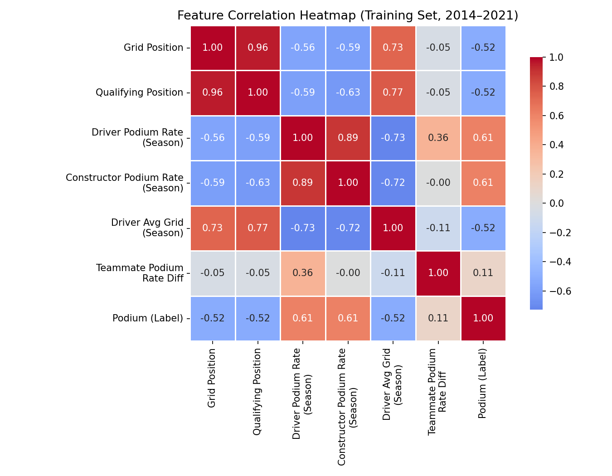
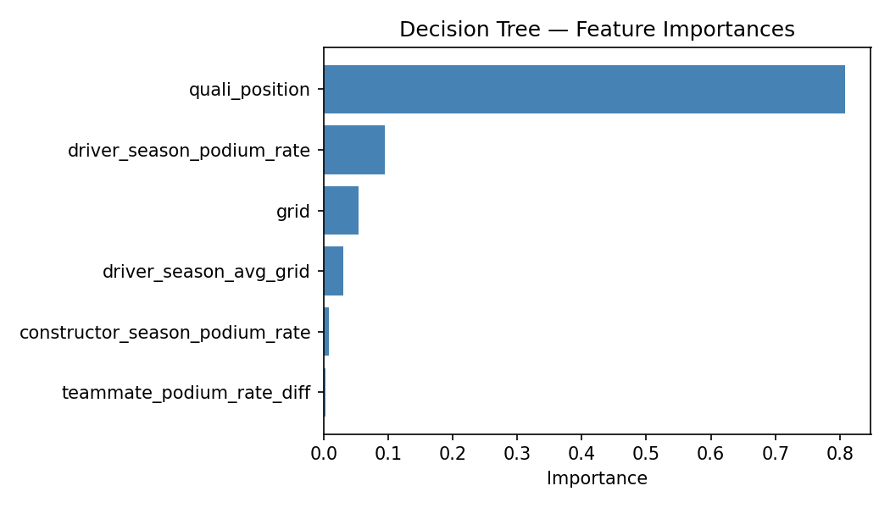
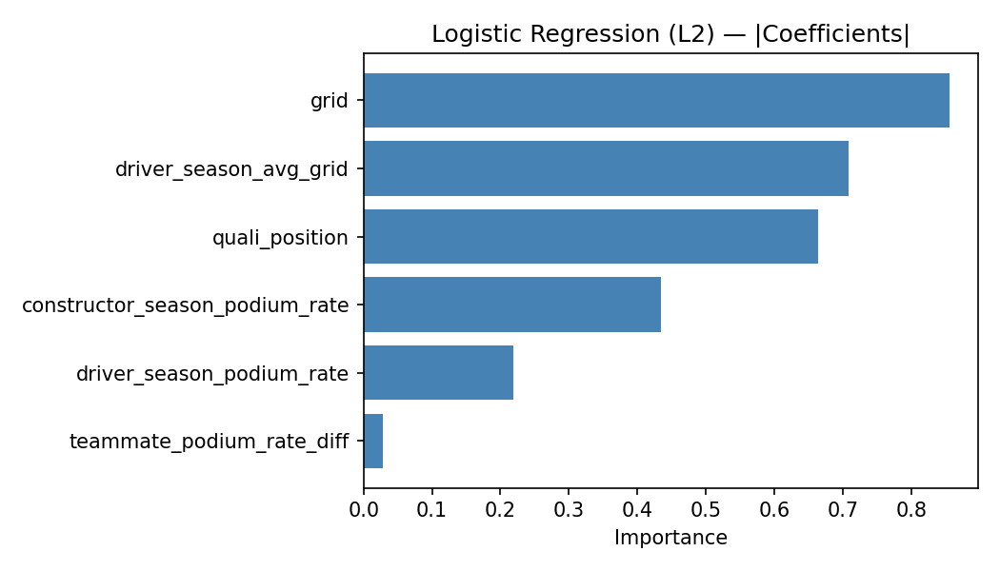
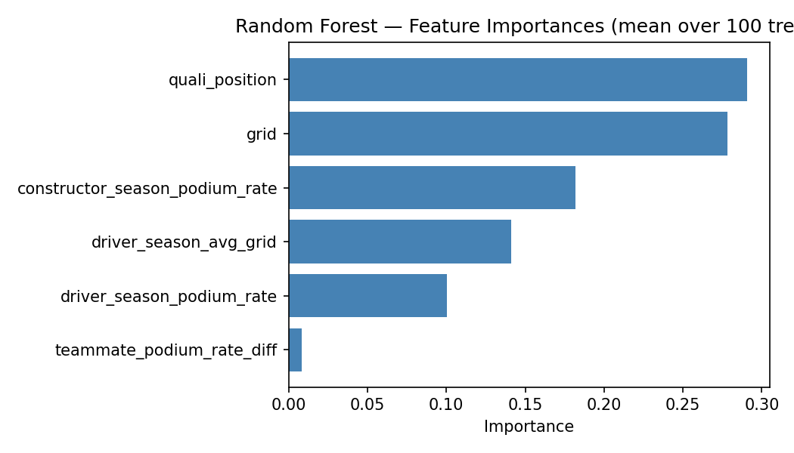
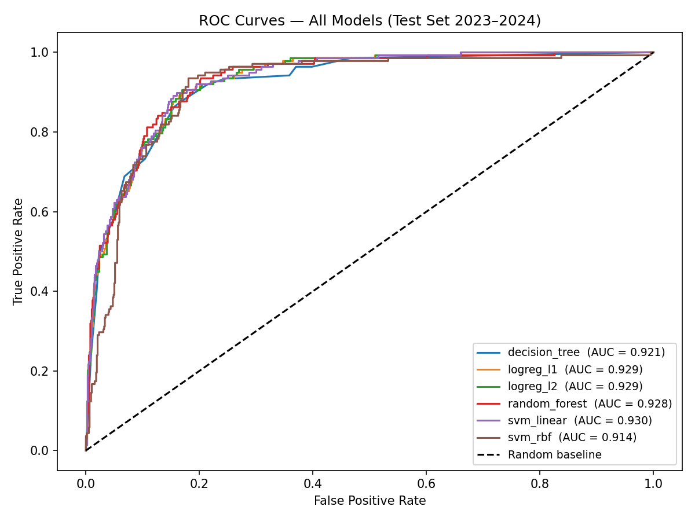

# 🏎️ F1 Race Outcome Prediction

> **Can we predict who stands on the podium? COMS 474 Final Project**


 
Machine learning models that predict Formula 1 podium finishes (P1–P3) using only pre-race data
 


 
---

## 🔮 How Does It Predict?
 
Before a race starts, we feed the model features we know *ahead of time* — grid position, qualifying result, and how the driver and constructor have been performing so far that season. The model outputs a probability that the driver finishes in the top 3.

> **What are we predicting?** Given pre-race data from any race in the 
> 2014–2024 era, the model predicts whether a driver will finish on the 
> podium. The model is validated on 2023–2024 seasons it has never seen 
> during training.
 
**Example:** 2022 Bahrain GP, predicting Leclerc:
 
| Feature | Value |
|---|---|
| Grid position | 1 (pole) |
| Qualifying position | 1 |
| Driver podium rate (season so far) | — (first race, uses season mean) |
| Constructor podium rate (season so far) | — (first race, uses season mean) |
 
→ Model outputs: **high podium probability** ✅ *(he won)*

---
 
## 📦 Dataset
 
- **Source:** [Formula 1 World Championship — Kaggle](https://www.kaggle.com/datasets/rohanrao/formula-1-world-championship-1950-2020)
- **Scope:** 2014–2024 (hybrid-turbo era only)
- **Why not earlier?** Pre-2014 regulation differences make constructor/driver strength non-comparable across eras. We stop at 2024 because the 2026 regulation overhaul completely reshuffled the power unit and aerodynamic landscape, making historical patterns unreliable for the current season.
- **Label:** Binary — `1` = podium (P1–P3), `0` = non-podium
- **Class balance:** ~14.8% podium rate (3 podiums per race × ~20 drivers)
 
---

## ⚙️ Features
 
| Feature | Description |
|---|---|
| `grid` | Starting grid position |
| `quali_position` | Qualifying classification position |
| `driver_season_podium_rate` | Driver's podium rate across all prior races this season |
| `constructor_season_podium_rate` | Constructor's podium rate across all prior races this season |
| `driver_season_avg_grid` | Driver's average grid position across all prior races this season |
| `teammate_podium_rate_diff` | Driver's podium rate minus their teammate's this season |
 
> All rolling stats use a **shift(1) expanding window** — the current race is never included in its own features to prevent data leakage.
 
---

## 🤖 Models
 
| Model | Type | Notes |
|---|---|---|
| Logistic Regression (L2) | Linear | Baseline classifier |
| Logistic Regression (L1) | Linear | Sparse — good for feature selection |
| SVM Linear | Linear | Maximum margin classifier |
| SVM RBF | Nonlinear | Captures complex decision boundaries |
| Decision Tree | Nonlinear | Interpretable structure |
| Random Forest | Nonlinear | Ensemble of decision trees |
 
---
 
## 📊 Results
 
**Validation Set (2022 season)**
 
| Model | Accuracy | Precision | Recall | F1 | ROC-AUC |
|---|---|---|---|---|---|
| Logistic Regression L2 | 0.8682 | 0.5345 | 0.9394 | 0.6813 | 0.9445 |
| Logistic Regression L1 | 0.8682 | 0.5345 | 0.9394 | 0.6813 | 0.9443 |
| **SVM Linear** | **0.8705** | 0.5385 | 0.9545 | **0.6885** | **0.9459** |
| SVM RBF | 0.8545 | 0.5078 | **0.9848** | 0.6701 | 0.9382 |
| Decision Tree | 0.8432 | 0.4885 | 0.9697 | 0.6497 | 0.9358 |
| Random Forest | 0.8636 | 0.5254 | 0.9394 | 0.6739 | 0.9440 |
 
**Test Set (2023–2024 seasons)**
 
| Model | Accuracy | Precision | Recall | F1 | ROC-AUC |
|---|---|---|---|---|---|
| Logistic Regression L2 | 0.8390 | 0.4808 | 0.9058 | 0.6281 | 0.9286 |
| Logistic Regression L1 | 0.8357 | 0.4753 | 0.9058 | 0.6234 | 0.9286 |
| **SVM Linear** | 0.8335 | 0.4717 | 0.9058 | 0.6203 | **0.9295** |
| SVM RBF | 0.8107 | 0.4396 | **0.9493** | 0.6009 | 0.9139 |
| Decision Tree | 0.8052 | 0.4305 | 0.9203 | 0.5866 | 0.9206 |
| **Random Forest** | **0.8498** | **0.5000** | 0.8623 | **0.6330** | 0.9283 |
 
> High recall (~0.93–0.98) means the models catch almost every real podium. Lower precision reflects the inherent difficulty of the class imbalance — only 3 of ~20 drivers podium per race.

### Feature Correlation Heatmap


### Feature Importance




### ROC Curves

 
---

## 🗂️ Repo Structure
 
```
RaceOutcomePred/
├── data/
│   └── raw/          # Kaggle CSVs here (not tracked in git)
├── src/
│   ├── data_loader.py
│   ├── features.py
│   ├── train.py
│   ├── evaluate.py
│   └── heatmap.py
├── models/           # saved model files (not tracked in git)
├── results/          # metrics, plots
├── requirements.txt
└── README.md
```
 
---
 
## 🚀 Setup & Usage
 
```bash
# 1. Clone the repo
git clone https://github.com/Sandeeptha-NotAbot/RaceOutcomePred.git
cd RaceOutcomePred
 
# 2. Create and activate virtual environment
python3 -m venv venv
source venv/bin/activate
 
# 3. Install dependencies
pip install -r requirements.txt
```
 
Download the Kaggle dataset and place all CSV files in `data/raw/`, then:
 
```bash
# Train all models
python -m src.train
 
# Evaluate and generate plots
python -m src.evaluate
 
# Generate feature correlation heatmap
python -m src.heatmap
```
 
All outputs saved to `results/`.
 
---
 
## 👩‍💻 Team
 
| Name | GitHub |
|---|---|
| Sandeeptha Madan | [@Sandeeptha-NotAbot](https://github.com/Sandeeptha-NotAbot) |
| Evan Sivets | [@boots99](https://github.com/boots99) |
 
*Iowa State University — COMS 474: Introduction to Machine Learning*